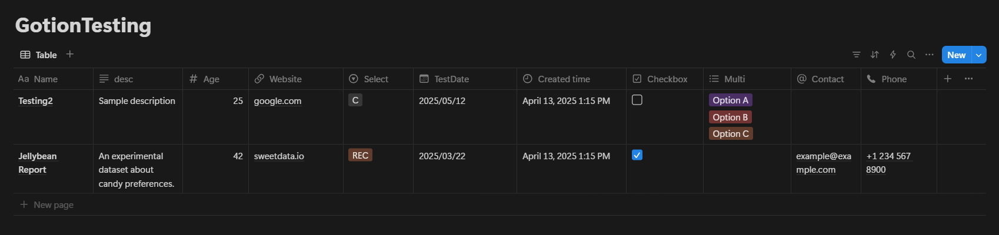

<!-- Shield Icons -->
<p align="center">
  <a href="https://github.com/HarmonicHemispheres/gotion">
    
  </a>
  <a href="https://github.com/HarmonicHemispheres/gotion/commits/main">
    
  </a>
  <br>
  <i>
a cli tool for uploading json and csv records to notion databases  
  </i>
</p>
<center>
</center>


<br>

# Testing

Pre-Req:
- make sure to create a custom integration on your notion workspace
- enable the integration on your notion database

### Testing Data
```json
[
  {
    "properties": {
      "Name": "Jellybean Report",
      "desc": "An experimental dataset about candy preferences.",
      "Age": 42,
      "Website": "https://sweetdata.io",
      "Select": "REC",
      "TestDate": { "date": { "start": "2025-03-22T00:00:00-07:00", "end": null } },
      "Multi": ["Option A", "Option B", "Option C"],
      "Checkbox": true,
      "Contact": "example@example.com",
      "Phone": "+1 234 567 8900"
    }
  },
  {
    "properties": {
      "Name": "Testing2",
      "desc": "Sample description",
      "Age": 25,
      "Website": "https://google.com",
      "Select": "C",
      "Multi": ["Option A", "Option B", "Option C"],
      "TestDate": { "date": { "start": "2025-05-12T00:00:00-07:00", "end": null } }
    }
  }
]
```
### Insert data into Notion


```
gotion insert --db "your-database-id" --data "data.json" --api-key "your-api-key"
```





<br>
<br>

# Building from Source

```ps1
.\make.ps1 -version "1.2.3"
```
